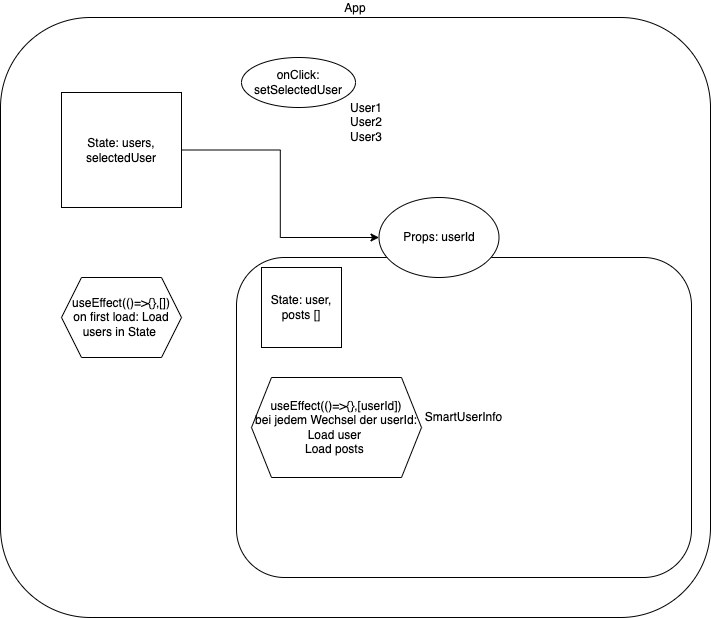

# Getting Started with Create React App

- Erweitere die Komponente SmartUserInfo so, dass sie zu dem ausgewählten User auch noch die dazugehörigen Todos anzeigt.
- Beispielaufruf API: https://jsonplaceholder.typicode.com/users/2/todos
- Architektur:
  
